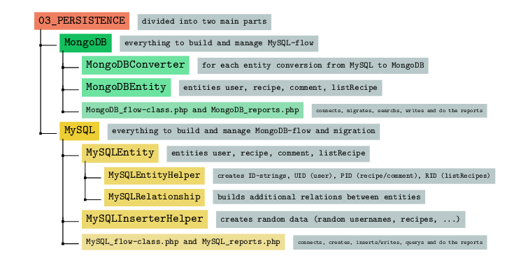

# Recipe Website

## about
A website where you can manage (add, remove, update, delete, filter, ...) recipes for dishes and assign them to recipe books (collections), which can also be managed. The main focus of this project - as a university project (University of Vienna) (Information Management & Systems Engineering, authors: Prof. Erich Schikuta, Dipl.-Ing. Ralph Vigne, summer semester 2023) - is on the technology stack (*Docker, DB: SQL vs NoSQL*):
- **Docker**
- **Migrate database while running**: between the **two database systems** (**MySQL**, **MongoDB**) while the website is up and running (MySQL as relational database management systems/**SQL** and MongoDB as relational database management systems/**NoSQL**)
- PHP (pure, backend and frontend) and NGINX
- team project together with *Mariia Ermeichuk*


- website-layout (index):
  - only index page, further layout see further below


## project setup and boot website (docker)
- *setup in short*: to directory `docker-compose.yaml`, in cmd run `docker-compose build` and than `docker-compose up` (takes some time to load all images/containers) and launch website http://localhost:80/
- *setup in long(er)*: To start the application, go to the root directory of the project and enter the command ‘docker-compose
build‘ in the terminal. This will create the necessary front-end and back-end containers from the provided
images. Once the build process is complete, you can launch the application by running ‘docker-compose up‘.
When the commands have finished executing, open any web browser and enter ”http://localhost:80/” in the
address bar. Currently, there is no implementation of an HTTPS version with a certificate file. Once on the
website you can push a green button ’Create MySQL Data’, then login with one of the users and test all
main use-cases and reports, which were described in M1 report.
- *graphical setup*:


## Docker overview (ports)
- docker MySQL: ``3306``
- myPHPAdmin: ``8001``
- docker MongoDB: ``27017``
- frontend/browser: ``80``
- nginx (1.21.5-alpine): ``80``

## project structure
> Note: more information in the PDF **ISME_Recipe_Website.pdf** (original as a university software project)

Similar to the three-part software layer model, the code was also designed in an object-oriented manner. First
of all, the index.php can be found outside by default, the ”Dockerfile” organizes all the necessary library inputs
and LayoutHTML organizes the headers of the respective webpages. The top of the layer-system build the
externally visible GUI part (”01 UI”), which manages all webpages with a respective php file. A mixture of
PHP and HTML can therefore be found throughout these files in this folder.
The second layer (”02 SERVICE”) is the service layer, which, however, is very narrow here and does not
control and regulate user input to the usual extent. Therefore, there is only one controllerer class in this
folder.
The third layer (”03 PERSISTENCE”) forms the main part of the project. On the one hand, this contains
the business logic and thus access to the two database management systems. This part is therefore split into
two parts, MySQL and MongoDB. Thus, both database management system worlds were cleanly separated
from each other.


In order to dwell a little more on the main structure of the project, it is worth considering the third layer in
more detail. The first half is the MySQL part, which organizes and initially prepares the basic data structure
with MySQLEntity and the included folders. Initially, SQL tables are created here and filled with sample
code. The folder MySQLInserterHelper, which creates the respective entity objects with its factory classes,
which are later injected into the SQL tables, also helps here.


The second half is the MongoDB part, which initially provides the basic data structure with MongoDBEntity
and other MongoDB flow classes (e.g. MongoDBWriter.php, MongoDBInserter.php or MongoDBConnector.
php), analogous to the MySQL part. On the other hand, this folder contains the location where the
migration from MySQL to MongoDB is carried out and thus contains some SQL-code.


## website layout
> Note: switch between SQL (MySQL) and NoSQL (MongoDB) via yellow button "*Convert to MongoDB*"

- website running on SQL (MySQL)

- website running on NoSQL (MongoDB)


<br>

- recipe page


<br>

- filter page (top rated recipes by a category) (made by Mariia Ermeichuk)


<br>


- filter page (most successful recipe books (listRecipes))


<br>

- for computer science purpose: raw document view (JSON) can also be seen after migration 


```json
stdClass Object
(
    [_id] => MongoDB\BSON\ObjectId Object
        (
            [oid] => 65d60120d8b06a740f0e0822
        )

    [listName] => indulgent desserts
    [listDescription] => indulge in mouthwatering desserts
    [privateStatus] => 1
    [recipes] => Array
        (
            [0] => stdClass Object
                (
                    [recipeName] => burger
                    [recipeDescription] => ground beef, buns, cheese, lettuce, tomatoes
                    [category] => Burgers
                    [rating] => 2.66667
                    [comment] => Array
                        (
                            [0] => stdClass Object
                                (
                                    [commentContent] => below average
                                    [ownerName] => emilyjones
                                    [creationDate] => 2023-05-27 13:48:20
                                    [editedDate] => 2023-05-27 23:50:24
                                )

                            [1] => stdClass Object
                                (
                                    [commentContent] => better than expected
                                    [ownerName] => johndoe
                                    [creationDate] => 2020-02-22 11:59:40
                                    [editedDate] => 2020-02-23 09:47:50
                                )

                            [2] => stdClass Object
                                (
                                    [commentContent] => just okay
                                    [ownerName] => ethanroberts
                                    [creationDate] => 2022-08-01 08:22:01
                                    [editedDate] => 2022-08-01 19:56:24
                                )

                        )

                    [creationDate] => 2021-01-07 19:50:51
                    [editedDate] => 2021-01-08 04:10:47
                )

        )

    [likes] => 4
    [creationDate] => 2019-07-23 03:21:14
    [editedDate] => 2019-07-23 20:56:11
)

stdClass Object
(
    [_id] => MongoDB\BSON\ObjectId Object
        (
            [oid] => 65d60120d8b06a740f0e0823
        )

    [listName] => healthy salads
    [listDescription] => fresh and nutritious salad recipes
    [privateStatus] => 1
    [recipes] => 
    [likes] => 2
    [creationDate] => 2022-01-08 21:18:35
    [editedDate] => 2022-01-08 21:37:14
)

stdClass Object
(
    [_id] => MongoDB\BSON\ObjectId Object
        (
            [oid] => 65d60120d8b06a740f0e0824
        )

    [listName] => festive treats
    [listDescription] => festive recipes for special occasions
    [privateStatus] => 0
    [recipes] => 
    [likes] => 1
    [creationDate] => 2018-03-23 00:17:40
    [editedDate] => 2018-03-23 19:18:29
)

...
```